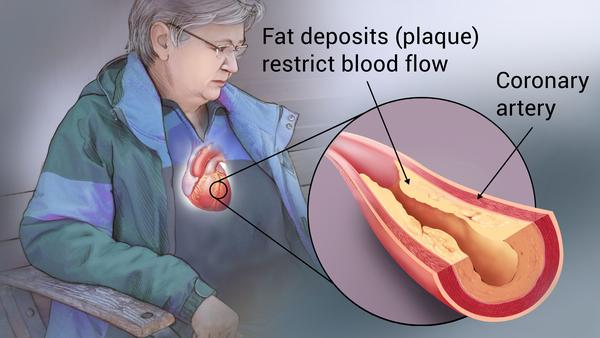

---
# HEART DISEASE PREDICTION USING CLASSIFICATION MODELS
---

---

### Dataset Information

##### Source Information:
   -- [Cleveland Clinic Foundation (cleveland.data)](https://archive.ics.uci.edu/ml/machine-learning-databases/heart-disease/)

    V.A. Medical Center, Long Beach and Cleveland Clinic Foundation: Robert Detrano, M.D., Ph.D.
---
##### Number of Instances: 
    303
---    
##### Attribute Information:
    Only 14 used out of 76
    
        1. #3  (Age)          age in years  
        
        2. #4  (Sex)          sex (1 = male; 0 = female)
        3. #9  (ChestPain)    chest pain type(1: typical angina, 2: atypical angina, 3: non-anginal pain, 4: asymptomatic)
        
        4. #10 (RestBPS)      resting blood pressure (in mm Hg)
        
        5. #12 (Cholestrol)   serum cholestoral in mg/dl
        
        6. #16 (FBS)          fasting blood sugar > 120 mg/dl (1 = true; 0 = false)
        
        7. #19 (RestECG)      resting ecg (0: normal, 1: having ST-T wave abnormality, 2: left ventricular hypertrophy)
        
        8. #32 (MaxHR)        maximum heart rate achieved
        
        9. #38 (Exang)        exercise induced angina (1 = yes; 0 = no)
        
        10. #40 (OldPeak)     ST depression induced by exercise relative to rest
        
        11. #41 (Slope)       slope of peak exercise ST segment (1: upsloping, 2: flat, 3: downsloping)
        
        12. #44 (Nmajvess)    number of major vessels (0-3) colored by flourosopy
        
        13. #51 (Thal)        Thallasemia 3 = normal; 6 = fixed defect; 7 = reversable defect
        
        14. #58 (ADS)       (the predicted attribute)
                              diagnosis of heart disease (angiographic disease status)
                              0: less than 50% narrowing in any major vessel, 
                              1-4: more than 50% narrowing in 1-4 vessels
                            UPDATED AS BELOW, AS ENOUGH DATA WAS NOT PROVIDED
                              0: < 50% diameter narrowing
                              1: > 50% diameter narrowing

---
# CONCLUSION
---

##  1. Naive-Bayes Model performed best, with 88.16% accuracy over test set, both before and after the features were extracted.

## 2. 'Thal', 'Nmajvess', 'OldPeak', 'Slope', 'MaxHR', 'ChestPain', 'Exang', 'Sex' (8/14) had come out to be major predictors. Only MaxHR, among them, is indirectly proportional to ADS.
 
